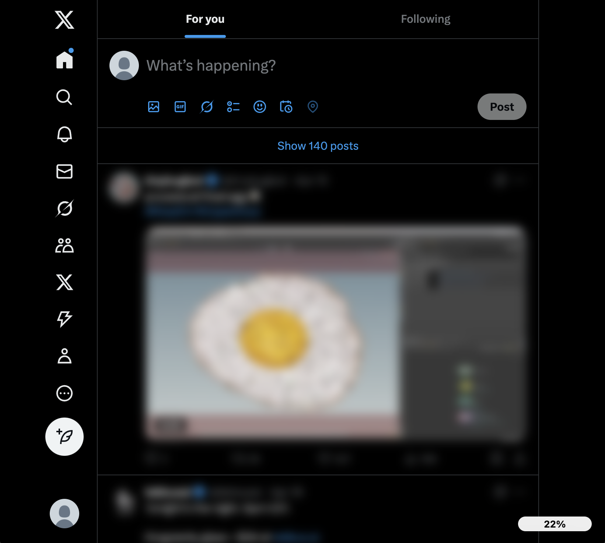

# SNS疲労軽減拡張機能

SNSの過剰利用による精神的疲労を軽減するためのChrome/Edge拡張機能です。

## 疲労度によるぼかし効果の例

| 通常表示 | ぼやけ始め | 完全にぼやけた状態 |
|----------|------------|-------------------|
|  |  |  |


## 機能

- SNSサイト（Twitter/X, Facebook, Instagramなど）の閲覧時間を追跡
- 滞在時間に基づく「疲労ゲージ」の表示
- 疲労度が高まると、SNSコンテンツを徐々にぼかす機能
- ワンクリックでサイドパネルを開き、現在閲覧中のコンテンツを要約表示
- 詳細な設定画面でのカスタマイズオプション

## インストール

### ユーザーとして

1. Chrome/Edge ウェブストアから「SNS疲労軽減拡張機能」を検索してインストール
2. ブラウザの拡張機能アイコンからアクセス可能

### 開発者として

1. リポジトリをクローン
   ```
   git clone https://github.com/yourusername/sns-fatigue-reducer.git
   cd sns-fatigue-reducer
   ```

2. 依存関係のインストール
   ```
   npm install
   ```

3. 開発サーバーの起動
   ```
   npm run dev
   ```

4. ビルド
   ```
   npm run build
   ```

5. ブラウザにインストール
   - Chrome/Edge で `chrome://extensions` を開く
   - 「デベロッパーモード」を有効化
   - 「パッケージ化されていない拡張機能を読み込む」をクリック
   - ビルドされたディレクトリ（通常は `dist`）を選択

## 開発環境のセットアップ

### 必要なツール

- Node.js (v16以上)
- npm または yarn
- Webブラウザ (Chrome/Edge)

### プロジェクト構造

```
sns-fatigue-reducer/
├── src/
│   ├── components/        # Reactコンポーネント
│   │   ├── Popover.tsx
│   │   ├── SidePanel.tsx
│   │   ├── FatigueGauge.tsx
│   │   └── OptionsPage.tsx
│   ├── content.ts         # コンテンツスクリプト
│   ├── sw.ts              # Service Worker
│   ├── popup.html         # ポップアップHTML
│   ├── options.html       # 設定ページHTML
│   └── sidepanel.html     # サイドパネルHTML
├── public/
│   ├── manifest.json      # 拡張機能マニフェスト
│   └── icons/             # アイコン画像
├── api/                   # FastAPI要約API
│   ├── main.py
│   └── requirements.txt
├── package.json
├── tsconfig.json
├── webpack.config.js
└── README.md
```

### ビルド・実行手順

1. 開発モードで実行
   ```
   npm run dev
   ```
   
   これにより webpack を使用して `src` ディレクトリのファイルを監視し、変更があるたびに自動的に再ビルドします。

2. 本番用ビルド
   ```
   npm run build
   ```
   
   これにより最適化された拡張機能が `dist` ディレクトリに生成されます。

### 要約API

要約APIはFastAPIで実装されています。以下の手順でAPIサーバーを起動できます：

1. 必要なパッケージのインストール
   ```
   cd api
   pip install -r requirements.txt
   ```

2. サーバーの起動
   ```
   uvicorn main:app --reload
   ```
   
   これにより、デフォルトで `http://localhost:8000` でAPIサーバーが立ち上がります。

3. 拡張機能の設定ページでAPIのURLを設定してください。

## 拡張機能ストアへの提出手順

1. ビルドした拡張機能をパッケージ化
   ```
   npm run package
   ```
   
   これにより、`dist` ディレクトリの内容が `sns-fatigue-reducer.zip` として圧縮されます。

2. Chrome ウェブストアデベロッパーダッシュボードにアクセス
   - https://chrome.google.com/webstore/devconsole/

3. 「新しいアイテム」をクリック

4. 圧縮したファイル (`sns-fatigue-reducer.zip`) をアップロード

5. 必要な情報を入力:
   - 説明文
   - スクリーンショット（少なくとも1280×800px、最大5枚）
   - プロモーションタイル画像
   - アイコン（128×128px）
   - カテゴリ（「生産性」など）
   - 言語

6. プライバシーポリシーURLを入力

7. 「公開」をクリックして申請を完了

### Microsoft Edge アドオンストアへの提出

1. Edge アドオン開発者ダッシュボードにアクセス
   - https://partner.microsoft.com/en-us/dashboard/microsoftedge/

2. 「新しい拡張機能を作成」をクリック

3. パッケージ化したファイルをアップロード

4. 必要情報を入力し、審査を待ちます

## ライセンス

MIT

## 貢献

バグ報告や機能リクエストは、GitHubのIssueを通じてお願いします。プルリクエストも歓迎します。
